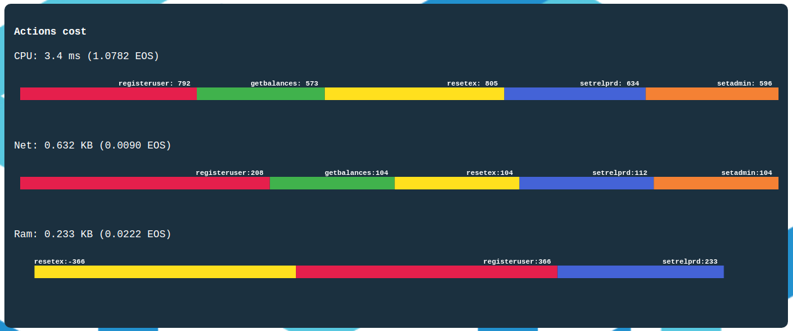
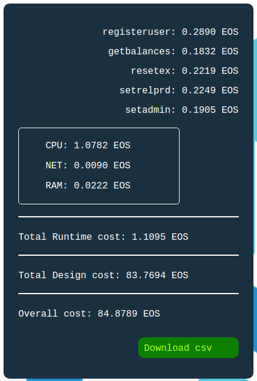

# EOS Contract Estimator

Comprehensive contract estimator to assess the design and runtime cost of a smart contract on the EOS chain.

## Technical Synopsis
- Deploy on the Byzantine testnet abi and wasm files and retrieve the response payload to assess the design cost of the smart contract.
- Test each action on the testnet and estimate independantly their EOS cost for CPU, RAM and NET.
- Generate a downloadable contract bill of the contract showing the cost is ms, bytes and their equivalent in EOS.

#### Actions Costs Monitor



#### Contract Cost Bill


## Install
if Unix:
```sh
npm install -g npm-check-updates
```
if Mac OS:
sudo npm install -g npm

## Build
```sh
npm run build
```

## Run dev mode
```sh
npm start
```

## Demo
Find the wasm and abi files of smart contracts in *./contract-estimator/src/contract* to test the tool.

